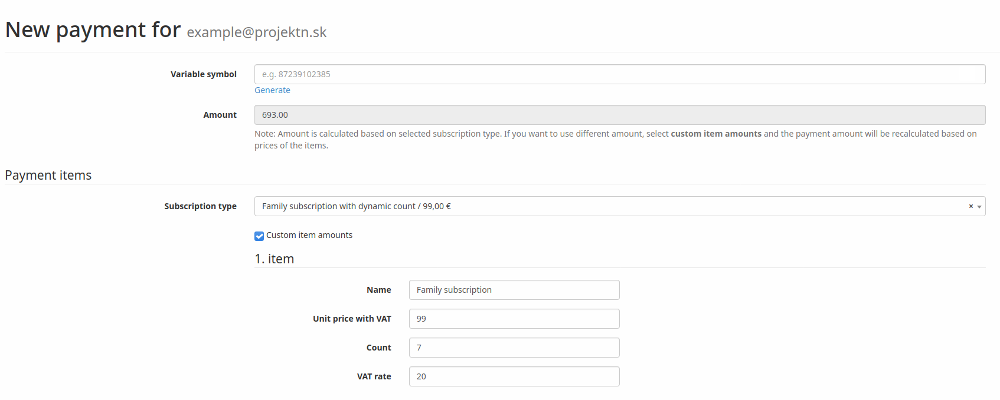
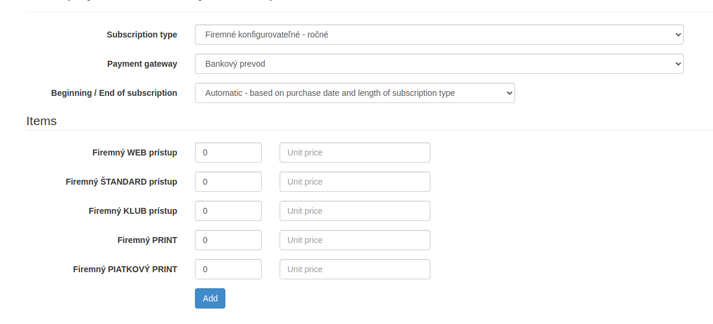

# CRM Family Module

[](https://hosted.weblate.org/projects/remp-crm/family-module/)

Family module is an extension to Subscriptions module providing parent/child relation between subscriptions. Parent subscription is able to trigger generation of child subscriptions via `family_requests`.

**WARNING**: Module is close-to-production quality, but expect some major breaking changes in the future (e.g. dropping of redundant tables, changing master/slave names). 

## Installation

Add `remp/crm-family-module` via repository or package to your `composer.json` file and install it to your CRM skeleton.

Enable installed extension in your `app/config/config.neon` file:

```neon
extensions:
	# ...
	- Crm\FamilyModule\DI\FamilyModuleExtension
```

## Usage

Family module needs to know which *subscription types* are meant to be *parents* and what subscription types should the child subscriptions have.

To do that, please seed the relations via `FamilySubscriptionTypesRepository::add()` method:

- `donationMethod`. Available values are:
  - `copy`: Child subscriptions will copy start/end date of its parent.
  - `fixed_days`: Child subscriptions will start at the time of activation and last fixed amount of days (implementation is currently not available).
- `count`. Number of child subscriptions to create when parent subscription is created.
- `is_paid`. Indicator used to flag whether child subscriptions should be counted as *paid* or not.

Anytime new master subscription is created, handler will create requests with codes that can be shared with other users so they can activate their access.

These codes can be accessed via two channels:

- As activation URLs in customer zone. You can enable the default widget in your own module by attaching following widget to the placeholder:

    ```php
    namespace Crm\DemoModule;

    class DemoModule
    {
        public function registerLazyWidgets(\Crm\ApplicationModule\Widget\LazyWidgetManagerInterface $lazyWidgetManager) {
            $lazyWidgetManager->registerWidget(
                'frontend.subscriptions.top',
                \Crm\FamilyModule\Components\FamilyRequestsListWidget\FamilyRequestsListWidget::class,
                300
            );
        }
    }
    ```
- As family codes via API. You can access all available family codes with parent's account token via [`/api/v1/family/list`](#get-apiv1familylist) API. These codes can be then activated via [`/api/v1/family/activate`](#post-apiv1familyactivate) API.

### ExtendFamilyExtension

You can use `ExtendFamilyExtension` subscription type extension method to extend your family/company subscriptions.

If CRM is creating new subscription with subscription type with this extension method, it tries to find all actual family subscriptions. If there is one, new subscription is appended after the actual. Otherwise the new subscription starts immediately (ignoring other non-family subscriptions).

The extension is registered automatically. If `FamilyModule` is enabled, you should be able to select it in your subscription type form.

### Renewal of child subscriptions

If the parent user account renews family/company subscription and new subscription starts at the same time as the previous one ends, child accounts are given new (renewed) subscriptions too. It's done automatically by event handler `\Crm\FamilyModule\Events\NewSubscriptionHandler`.

This time gap between subscriptions can be configured within your main config. For example if you want to allow renewal only 7 days after end of the subscription:

```latte
services:
	# ...
	familyNewSubscriptionHandler:
		setup:
			- setSubscriptionsTimeGap('7 days')
```

You can also prevent copying activated family requests at all, by adding meta `keep_requests_unactivated=1` to payment meta table.


### Dynamic count of child subscriptions

If you don't want to have static count of generated child subscriptions defined within `family_subscription_types.count`, you can set your family subscription's value `count` to 0 and define number of child subscriptions to generate within payment item count. Conditions:

- Type of payment item is `\Crm\SubscriptionsModule\PaymentItem\SubscriptionTypePaymentItem::TYPE`.
- Subscription type of payment item is family subscription type which is defined within `family_subscription_types` table with value 0.
- Payment item count is non zero.

Example of payment item set while creating payment from within admin interface:



In this case, handler `\Crm\FamilyModule\Events\NewSubscriptionHandler` generates 7 child subscriptions.

### Custom type and count of child subscriptions

If you want to have opportunity to define own combination of subscription types and their count you can do it by creating customizable subscription type with following steps:

- Define payment items for master subscription as `\Crm\SubscriptionsModule\PaymentItem\SubscriptionTypePaymentItem::TYPE` which will represent slave subscription types.
- Payment items must have meta (`payment_item_meta`) information with key `subscription_type_item_id` and value that refer to slave subscription type.
- Create family subscription type (`family_subscription_types`) with master subscription and previously defined and slave subscription type let `null`.

Admin interface in case of customizable subscription types is selected handles differently - display additional options for subscription type count and price. 

Example of creating the payment of family subscription with customizable subscription type:



By the creating of payment for family subscriptions the payment items are created according counts and prices entered in admin form. 
In this case, handler `\Crm\FamilyModule\Events\NewSubscriptionHandler` generates 6 child subscriptions (5 of WEB type and 1 of KLUB type).

## API documentation

All examples use `http://crm.press` as a base domain. Please change the host to the one you use
before executing the examples.

All examples use `XXX` as a default value for authorization token, please replace it with the
real tokens:

* *API tokens.* Standard API keys for server-server communication. It identifies the calling application as a whole.
They can be generated in CRM Admin (`/api/api-tokens-admin/`) and each API key has to be whitelisted to access
specific API endpoints. By default the API key has access to no endpoint. 
* *User tokens.* Generated for each user during the login process, token identify single user when communicating between
different parts of the system. The token can be read:
    * From `n_token` cookie if the user was logged in via CRM.
    * From the response of [`/api/v1/users/login` endpoint](https://github.com/remp2020/crm-users-module#post-apiv1userslogin) -
    you're free to store the response into your own cookie/local storage/session.

API responses can contain following HTTP codes:

| Value | Description |
| --- | --- |
| 200 OK | Successful response, default value | 
| 400 Bad Request | Invalid request (missing required parameters) | 
| 403 Forbidden | The authorization failed (provided token was not valid) | 
| 404 Not found | Referenced resource wasn't found | 

If possible, the response includes `application/json` encoded payload with message explaining
the error further.

---

#### GET `/api/v1/family/list`

Lists all available family codes of parent's account to share.

##### *Headers:*

| Name | Value | Required | Description |
| --- |---| --- | --- |
| Authorization | Bearer *String* | yes | User token of parent account. |


##### *Example:*

```shell
curl -s –XGET http://crm.press/api/v1/family/list \
-H "Content-Type:application/json" \
-H "Authorization: Bearer XXX"
```

Response:

```json5
{
    "codes": [
        {
            "code": "1dwupidm1gfdsbvcxbxcvb6527dni",
            "master_user_id": 1,
            "status": "created",
            "subscription_type_code": "donation_from_company_year_online",
            "slave_user_id": null,
            "created_at": "2019-05-24T12:40:28+02:00",
            "updated_at": "2019-05-24T12:40:28+02:00",
            "opened_at": null,
            "accepted_at": null,
            "canceled_at": null,
            "expires_at": null
        }
    ]
}
```

----

#### POST `/api/v1/family/activate`

Activates provided family code and creates child subscription on the authenticated account.

##### *Headers:*

| Name | Value | Required | Description |
| --- |---| --- | --- |
| Authorization | Bearer *String* | yes | User token of child account. |

##### *Payload*

```json5
{
    "code": "1dwupidm1gfdsbvcxbxcvb6527dni", // required; Family code to activate.
}
```

##### *Example:*

```shell
curl -s –XPOST http://crm.press/api/v1/family/activate \
-H "Content-Type:application/json" \
-H "Authorization: Bearer XXX" \
-d '{
    "code": "1dwupidm1gfdsbvcxbxcvb6527dni"
}'
```

Response:

```json5
{
    "code": "1dwupidm1gfdsbvcxbxcvb6527dni",
    "subscription": {
        "start_at": "2020-06-02T09:45:15+02:00",
        "end_at": "2021-06-02T09:45:15+02:00",
        "code": "donation_from_company_standard_year_online",
        "access": ["web"]
    }
}
```

## Work in progress...

**Fixed days child subscriptions**. Sometimes you might want to allow your users to generate child subscriptions independent of the master subscription that will last fixed amount of days. We plan to work on the implementation allowing to specify this in the `family_subscription_types`.

**Dynamic count of child subscriptions**. This will allow the ability to use single parent-child relation to generate dynamic number of child subscriptions based on a setting of parent subscription.   
